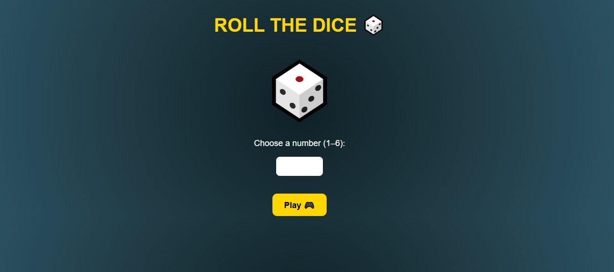
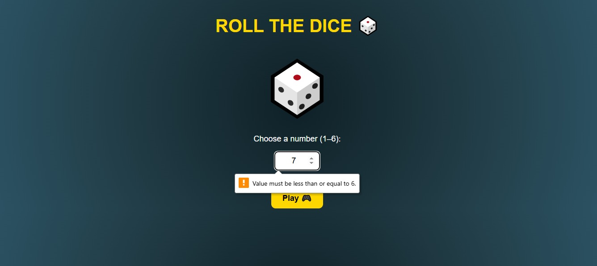
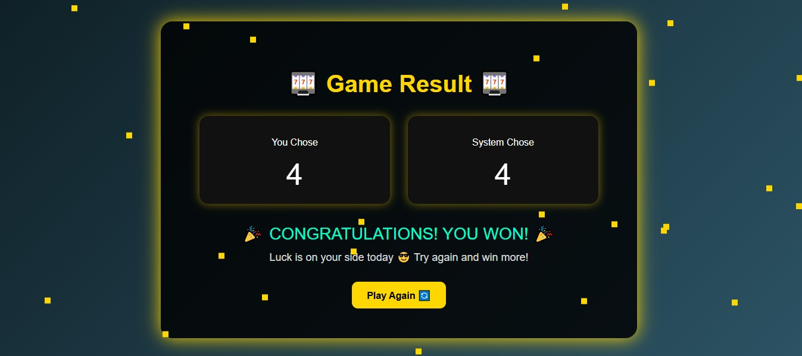
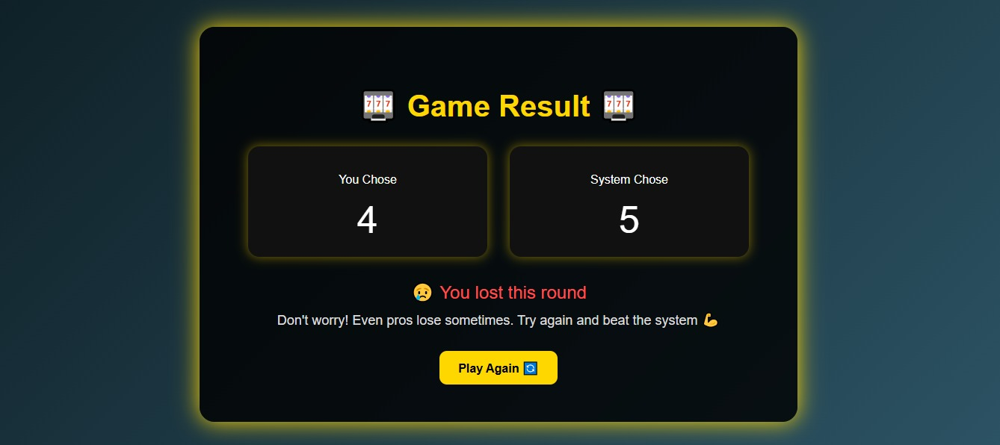
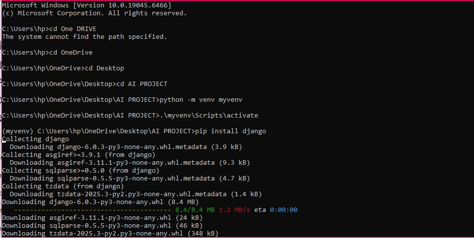

# AI-PROJECT
An interactive web game built with Django, and uses Random Number Generator to simulate dice rolls and determine win/lose outcomes.

**AI PROJECT – GAME SIMULATOR**

**Project Overview**

This project is a simple web-based dice game built using Python and Django.
The application allows a user to:
  1. Choose a number between 1 and 6
  2. Simulate a dice roll using a Random Number Generator
  3. Determine whether  a user wins or loses based on the matching number

**How to run the project (Screenshots)**
**Home Page**

 

 
 
**Result Page**

**Result- Win**

 
 
**Result-Lose**

 

**Objectives**

To build a functional Django web application with the help of AI

To demonstrate randomness using a Random Number Generator

To implement form handling and validation with the use of AI prompts

To create an interactive and visually appealing user interface

To document the development process using AI assistance

**Technologies Used**

Python, Django, HTML, CSS, and JavaScript, Claude (claude-sonnet-4-6), OpenAI GPT-4o, Gemini 1.5 Pro — Google

**System Architecture**

**Architecture Type**

Client-Server Architecture

**Flow**

User interacts with the frontend

Request sent to Django Backend

Backend processes logic

Response returned to the frontend

**Project Structure**

AI/

    settings.py
    urls.py
    
 game/
 
    views.py
     urls.py
     
     templates/
     
        home.html
        result.html

**Implementation Steps**

**Step 1: Project Setup**

Django installation

Created a new Django project (AI)

Created an app (game)

Registered the app in settings.py

 

**Step 2: URL Configuration**

Created a urls,py file in the app (game) where I created routes for the home page and the /play/ (Game logic)

Connected app URLs to the main project (AI)

**Step 3: Creating Views**

**Home View**

Display the home page

Contains the input form for user interaction

**Play View(Core Logic)**

User submits a number via the form

Input is retrieved using a request.POST.get()

Input is validated:

   Must not be empty
   
   Must be between 1-6
   
The system generates a random number

Numbers are compared

Results are displayed

**Step 4: Frontend Development**

**Home Page**

Input field restricted to numbers (1-6)

Play button

Error handling display

Animated rolling dice

Casino-themed styling

**Result Page**

Display:

 User number
 
 System number
 
 Result Includes:

  Confetti animation on win
  
  Encouraging message on loss
  
Styled with a modern casino interface

**Step 5: Testing**

Test Case	Input	Expected Result	Outcome

Valid Input	3	Win/Lose	Passed

Empty Input	None	Error message	Passed

Out of Range	10	Error message	Passed

**Challenges and Errors Encountered**

**1. Missing CSRF Token**

**Prompt Template Used**

I need help understanding this error message from my Python/Django application.

Here's the complete error message and stack trace:

Forbidden (403)
CSRF verification failed. Request aborted.
Help
Reason given for failure:
    CSRF token missing.
    
In general, this can occur when there is a genuine Cross Site Request Forgery, or when Django’s CSRF mechanism has not been used correctly. For POST forms, you need to ensure:
•	Your browser is accepting cookies.
•	The view function passes a request to the template’s render method.
•	In the template, there is a  template tag inside each POST form that targets an internal URL.
•	If you are not using CsrfViewMiddleware, then you must use csrf_protect on any views that use the csrf_token template tag, as well as those that accept the POST data.
•	The form has a valid CSRF token. After logging in in another browser tab or hitting the back button after a login, you may need to reload the page with the form, because the token is rotated after a login.
You’re seeing the help section of this page because you have DEBUG = True in your Django settings file. Change that to False, and only the initial error message will be displayed.
You can customize this page using the CSRF_FAILURE_VIEW setting.
My application context:
- This happened when I was trying to test my application on the UI
- The application is a game that uses a Random Number Generator to select a number randomly from 1-6 and compare it to the chosen number by the user to determine if the user wins or loses the game.
- I'm using Python 3.13.2 and Django 26.0.1
Could you:
1. Explain what this error means in simple, non-technical terms
2. Identify the most relevant lines in the stack trace (which ones actually point to my code)
3. List 2-3 of the most likely causes based on this type of error
4. Suggest what specific information I should look for in my code
5. Provide a step-by-step debugging approach I could follow
I'm particularly unfamiliar with Cross-Site Request Forgery mentioned in the error, so an extra explanation there would help.

**Fix:**

Django expected a security token but didn’t receive it, so it blocked the request. I added  inside my form

**2. URL Not Found (404)**

 **Prompt Template**
 
I need help diagnosing the root cause of an error in my Python/Django application.

Here's the error and stack trace:

Traceback (most recent call last):
  File "C:\Users\hp\AppData\Local\Programs\Python\Python313\Lib\threading.py", line 1041, in _bootstrap_inner
    self.run()
    ~~~~~~~~^^
  File "C:\Users\hp\AppData\Local\Programs\Python\Python313\Lib\threading.py", line 992, in run
    self._target(*self._args, **self._kwargs)
    ~~~~~~~~~~~~^^^^^^^^^^^^^^^^^^^^^^^^^^^^^
  File "C:\Users\hp\OneDrive\Desktop\AI PROJECT\myvenv\Lib\site-packages\django\utils\autoreload.py", line 64, in wrapper
    fn(*args, **kwargs)
    ~~^^^^^^^^^^^^^^^^^
  File "C:\Users\hp\OneDrive\Desktop\AI PROJECT\myvenv\Lib\site-packages\django\core\management\commands\runserver.py", line 134, in inner_run
    self.check(**check_kwargs)
    ~~~~~~~~~~^^^^^^^^^^^^^^^^
  File "C:\Users\hp\OneDrive\Desktop\AI PROJECT\myvenv\Lib\site-packages\django\core\management\base.py", line 496, in check
    all_issues = checks.run_checks(
        app_configs=app_configs,
    ...<2 lines>...
        databases=databases,
    )
  File "C:\Users\hp\OneDrive\Desktop\AI PROJECT\myvenv\Lib\site-packages\django\core\checks\registry.py", line 89, in run_checks
    new_errors = check(app_configs=app_configs, databases=databases)
  File "C:\Users\hp\OneDrive\Desktop\AI PROJECT\myvenv\Lib\site-packages\django\core\checks\urls.py", line 44, in check_url_namespaces_unique
    all_namespaces = _load_all_namespaces(resolver)
  File "C:\Users\hp\OneDrive\Desktop\AI PROJECT\myvenv\Lib\site-packages\django\core\checks\urls.py", line 63, in _load_all_namespaces
    url_patterns = getattr(resolver, "url_patterns", [])
  File "C:\Users\hp\OneDrive\Desktop\AI PROJECT\myvenv\Lib\site-packages\django\utils\functional.py", line 47, in __get__
    res = instance.__dict__[self.name] = self.func(instance)
                                         ~~~~~~~~~^^^^^^^^^^
  File "C:\Users\hp\OneDrive\Desktop\AI PROJECT\myvenv\Lib\site-packages\django\urls\resolvers.py", line 729, in url_patterns
    patterns = getattr(self.urlconf_module, "urlpatterns", self.urlconf_module)
                       ^^^^^^^^^^^^^^^^^^^
  File "C:\Users\hp\OneDrive\Desktop\AI PROJECT\myvenv\Lib\site-packages\django\utils\functional.py", line 47, in __get__
    res = instance.__dict__[self.name] = self.func(instance)
                                         ~~~~~~~~~^^^^^^^^^^
  File "C:\Users\hp\OneDrive\Desktop\AI PROJECT\myvenv\Lib\site-packages\django\urls\resolvers.py", line 722, in urlconf_module
    return import_module(self.urlconf_name)
  File "C:\Users\hp\AppData\Local\Programs\Python\Python313\Lib\importlib\__init__.py", line 88, in import_module
    return _bootstrap._gcd_import(name[level:], package, level)
           ~~~~~~~~~~~~~~~~~~~~~~^^^^^^^^^^^^^^^^^^^^^^^^^^^^^^
  File "<frozen importlib._bootstrap>", line 1387, in _gcd_import
  File "<frozen importlib._bootstrap>", line 1360, in _find_and_load
  File "<frozen importlib._bootstrap>", line 1331, in _find_and_load_unlocked
  File "<frozen importlib._bootstrap>", line 935, in _load_unlocked
  File "<frozen importlib._bootstrap_external>", line 1022, in exec_module
  File "<frozen importlib._bootstrap_external>", line 1160, in get_code
  File "<frozen importlib._bootstrap_external>", line 1090, in source_to_code
  File "<frozen importlib._bootstrap>", line 488, in _call_with_frames_removed
  File "C:\Users\hp\OneDrive\Desktop\AI PROJECT\AI\AI\urls.py", line 6
    path(''include('game.urls'))
         ^^^^^^^^^^^^^^^^^^^^^^
SyntaxError: invalid syntax. Perhaps you forgot a comma?

Here are the relevant code snippets from files mentioned in the stack trace:
File: (AI) urls.py

from django.contrib import admin
from django.urls import path, include

urlpatterns = [
    path('admin/', admin.site.urls),
    path('' include('game.urls'))
]

Additional context:

- This error occurs when I try to access my UI  
- It happens consistently
- I've already tried include commas in my code immediately after the single quotes and at the end of the last url pattern.
  
Could you please:

1. Identify the likely root cause (not just the symptoms)
2. Explain the chain of events leading to this error
3. Suggest 2-3 specific code changes that might fix the issue
4. Recommend tests I could write to verify the fix
5. Explain any patterns or anti-patterns you notice that might cause similar problems elsewhere
6. Suggest debugging tools or techniques specific to this type of error
   
I'm most confused about new_errors = check(app_configs=app_configs, databases=databases) mentioned in the error message so detailed explanation there would be helpful.

**Fix:**

I added the necessary commas and properly linked the project’s urls.py and the app’s urls.py.

**Use of AI in the Project**

**1. To Understand How The Random Number Generator works and how to go about it**
   
**Prompt Template Used**

I am a junior developer with basic knowledge of Python/Django, I can set up a Django project, models, different views, apply migrations, register models in the admin, create a SuperUser, enable static files in Django and create static and media directories inside the project, implement Http methods used in views, and also create different HTML templates with CSS stylings, but I do not understand the Random Number Generator and how to go about it. Take the role of a Senior developer and explain the RNG concept and how to go about it, relating it to my already known concepts from above for better understanding and also ask me questions that will determine my understanding of the concept and give examples of code snippets to go about the RNG.

**Outcomes:**

Understood the use of a Random Number Generator(RNG)

RNG concept explained using Django Knowledge(request- processing- response cycle)

Understood how RNG works in Python

Understood how to connect RNG to my existing skills

Got edge cases to consider when implementing the RNG in my project

Got self-assessment questions that improved my understanding

**2. Documentation( Include Comprehensive Code Comments in my view)**

**Prompt Used**

Please create comprehensive code comments for this function, following Python conventions

def play(request):
    if request.method == "POST":
        user_number = request.POST.get('number')

        if not user_number:
            return render(request, 'home.html', {
                'error': 'Please enter a number between 1 and 6'
            })

        user_number = int(user_number)

        if user_number < 1 or user_number > 6:
            return render(request, 'home.html', {
                'error': 'Number must be between 1 and 6'
            })

        system_number = random.randint(1, 6)

        if user_number == system_number:
            result = "You Win! 🎉"
        else:
            result = "You Lose 😢"

        return render(request, 'result.html', {
            'user_number': user_number,
            'system_number': system_number,
            'result': result
        })

    return render(request, 'home.html')

The documentation should include:

A clear description of what the function does

All parameters with types and descriptions

Return value with type and description

Any exceptions or errors that might be thrown

Example usage

Any important notes or edge cases that developers should be aware of

**Outcomes:**

Generated structured comments

Improved Code readability

Helped document parameters, returns, and logic

**3. Documentation(Explaining the intent and Logic behind a code)**

I need help documenting the intent and logic behind this code. Please:

    
🎲

    

        
            
{{ error }}

        

        <form method="POST" action="">
            

            <label>Choose a number (1–6):</label>  

            <input type="number" name="number" min="1" max="6" required>

              

            <button type="submit">Play 🎮</button>
        </form>

    

    
</body>

Explain what this code is trying to accomplish at a high level

Break down the logic step-by-step

Identify any assumptions or edge cases in the implementation

Suggest inline comments for complex parts

Note any potential improvements while maintaining the original functionality

**Outcomes:**

Helped in documenting a high-level explanation for the code

Helped in the documentation of the step-by-step logic breakdown

Generated assumptions and edge cases

Suggested inline code comments

Suggested potential improvements without changing the functionality

**Conclusion**

This project demonstrates how a simple game can be built using Django while incorporating randomness, user interaction, and frontend design. It highlights the importance of validation, security, and structured development in building reliable web applications.
Additionally, the successful implementation of this project was significantly enhanced by well-structured, effective AI prompts. These prompts supported a deeper understanding of key concepts such as the Random Number Generator, improved debugging processes, and guided the creation of clear and professional documentation. This demonstrates how AI, when used strategically, can accelerate learning, improve code quality, and support efficient problem-solving in software development.

**Name:** Modestah Inyanji Ngome

**Course:** AI

